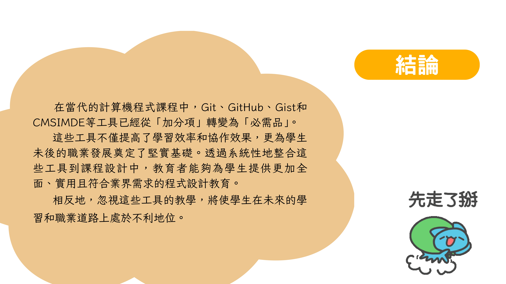

# w4 計算機程式專題報告

**組員**：陳漢宸、溫振豪、周昱翰、葉柏驊、李承祐  
**日期**：2025 年 10 月 1 日

## 主題
什麼是 git, GitHub, gist 與 CMSIMDE? 如何使用這些工具？為什麼要使用這些工具？

## 目錄
1. [引言](#引言)
2. [Git與程式設計課程的關係](#git與程式設計課程的關係)
3. [GitHub與程式設計課程的關係](#github與程式設計課程的關係)
4. [Gist與程式設計課程的關係](#gist與程式設計課程的關係)
5. [CMSIMDE與程式設計課程的關係](#cmsimde與程式設計課程的關係)
6. [綜合分析與結論](#綜合分析與結論)

## 專題報告內容

### 第 1 頁

### 第 2 頁  

### 第 3 頁

### 第 4 頁  

### 第 5 頁

### 第 6 頁  

### 第 7 頁

### 第 8 頁  

### 第 9 頁

### 第 10 頁  

### 第 11 頁

